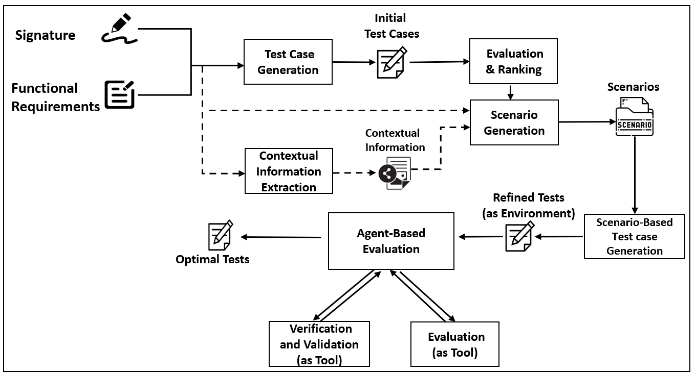

# Replication package for paper "Scenario-Driven Test Case Generation withAutonomous Agents"


# TestCopilot
Scenario-enriched LLM-based framework for automatic test case generation, bug detection, and code evaluation.

Scenario-Driven Test Case Generation with Autonomous Agents

🚀 Overview

TestCopilot is a multi-agent framework designed to automate software test case generation using Large Language Models (LLMs). It integrates scenario-enriched prompting, bug detection, and coverage analysis to produce high-quality and maintainable test suites. The system is benchmarked on HumanEval and MBPP, demonstrating state-of-the-art performance across correctness, coverage, and maintainability metrics.

🔍 Motivation

Traditional test generation methods often:

    Rely on code alone, lacking functional context

    Miss complex or deep execution paths

    Struggle with bug detection and validation

To address these issues, TestCopilot employs a context-aware, multi-agent prompting system that generates, evaluates, and refines test cases using both functional requirements and code.

📊 Performance Highlights

TestCopilot significantly outperforms existing models:
Metric	TestCopilot
TCE (HumanEval)	99.3%
DDP (HumanEval)	 99.7%
Function Coverage	89.5%
Bugs Detected (HumanEval)	179
False Alarms	0
🔑 Key Features
✅ Scenario-Enriched Prompting

Integrates functional requirements and user stories to guide LLMs in generating purpose-driven test cases.
🧠 Multi-Agent Evaluation

Includes separate agents for generation, bug detection, test refinement, and repair validation.
📈 Deep Coverage Analysis

Calculates statement, branch, path, and integration coverage along with maintainability scores.
🔄 Test Repair Feedback Loop

Fixes incomplete or incorrect test cases using iterative improvement agents.

📦 TestCopilot/
│
├── 📂 dataset/                  # HumanEval / MBPP test scenario datasets
│   ├── testcases.xlsx
│   ├── scenarios.xlsx
│   ├── code_files/
│
├── 📂 agents/                   # Multi-agent modules
│   ├── Evaluator and fixer.py            # Test evaluation and test fixer agent
│
├── 📂 evaluation/              # Evaluation and metric calculation
│   ├── coverage_metrics.py
│   ├── ddp_tce_metrics.py
│   ├── maintainability.py
│
├── 📂 results/                 # Output logs, Excel summaries, comparison tables
│   ├── HumanEval_metrics.xlsx
│   ├── MBPP_metrics.xlsx
├── 📂 models/                  # LLM invocation and management
│   ├── openai_agent.py
│   ├── DeepSeek_agent.py
│   
│
├── .env                        # API Keys (OpenAI,DeepSeek)
├── requirements.txt           # Required packages
├── README.md                  # Documentation file


📌 Requirements
🖥️ System

    Python 3.9+

    Internet access for LLM API calls

📦 Python Libraries

openai
pandas
coverage
scikit-learn
transformers
sentence-transformers
Radon
PyTest_cov


Install them with:

pip install -r requirements.txt

🌐 API Keys

TestCopilot uses multiple LLM APIs. Set your keys in a .env file or as environment variables:

export OPENAI_API_KEY="your-key"
export DeepSeek_API_KEY="your-key"

🔍 Evaluation and Metrics

Evaluation metrics include:

    Function Coverage

    Statement Coverage

    Branch Coverage

    Path Coverage

    Integration Coverage

    TCE (Test Case Effectiveness)

    DDP (Defect Detection Power)

    Maintainability Index

    Bugs Detected vs False Alarms

## Running TestCopilot

To run TestCopilot on your dataset, use the following command:

```bash
python scripts/run_testcopilot.py --input_dir path/to/your/input --output_dir path/to/save/results
```

## 📦 Dataset Access

Due to size limits, datasets and pretrained outputs are stored externally.

📥 Download Dataset from Google Drive
🔗 HumanEval + MBPP TestCopilot Dataset (provide your real link)
