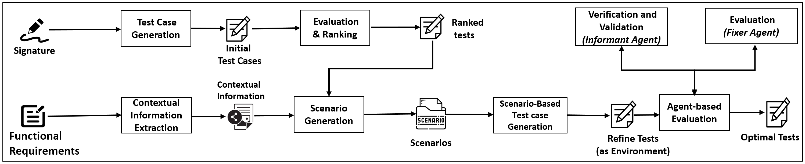

# TESTCOPILOT "Scenario-Driven Test Case Generation with Autonomous Agents''



**TESTCOPILOT** is a scenario-driven, multi-agent framework for generating **semantically accurate** and **coverage-effective** Python unit tests from **functional requirements** and **method signatures**.  
Instead of one-shot requirement→test translation, TESTCOPILOT **first synthesizes explicit execution scenarios**, then instantiates them into tests, and finally applies an **agent-based validation + repair loop** to eliminate invalid tests and reduce oracle errors.

This repository is the **replication package** for the paper:

> **Scenario-Driven Test Case Generation with Autonomous Agents**

---

## ✨ Key Idea (What’s different)
TESTCOPILOT introduces a **Scenario-driven Contextual Generation Framework (S-CGF)** and a **Scenario-Based Test Case Generation (STCG)** pipeline:

1. **Zero-shot initial tests** from (Requirement + Signature)
2. **Rank & select** candidates using mutation-based effectiveness + coverage (TCE, FAR, etc.)
3. **S-CGF contextual synthesis** (no external RAG corpus): generate and filter analogous scenarios to guide reasoning
4. **Scenario abstraction**: convert requirements into explicit behavioral scenarios (inputs → expected outputs)
5. **STCG instantiation**: generate executable `pytest` tests from scenarios
6. **Autonomous agent loop (Informant + Fixer)**: validate and minimally repair failing/invalid tests (max retries = 3)

---

## 📊 Reported Performance (Paper Results)

### HumanEval
- **TCE:** 99.3%
- **Coverage:** 99.5%
- **Bugs detected:** 179
- **False alarms:** 0
- **Maintainability Index:** 71.30%

### MBPP
- **TCE:** 99.3%
- **Coverage:** 99.5%
- **Bugs detected:** 157
- **False alarms:** 0
- **Maintainability Index:** 83.31%

### LeetCode
- **TCE:** 64.8%
- **Coverage:** 92.7%
- **Bugs detected:** 178
- **False alarms:** 43
- **Maintainability Index:** 47.5%

> Total evaluation scale: **58,912 test cases** across HumanEval, MBPP, and LeetCode.

---

## 🧩 Framework Components

### ✅ Scenario-Enriched Prompting
Transforms abstract requirements into **concrete execution scenarios** (precondition → action → expected outcome), improving edge-case reasoning and oracle fidelity.

### 🧠 Multi-Agent Evaluation (Informant + Fixer)
- **Informant Agent**: semantic gatekeeper (rejects invalid tests: signature mismatch, non-executable, vacuous asserts, requirement conflicts, non-determinism, etc.)
- **Fixer Agent**: minimal repair of tests without modifying the implementation under test  
- **Bounded retries**: max 3 repair attempts per test

### 📈 Coverage + Mutation-Based Evaluation
Metrics include:
- Test Case Effectiveness (TCE)
- False Alarm Rate (FAR)
- Function / Statement / Branch / Path coverage
- Maintainability Index (radon)

Tooling: `pytest`, `pytest-cov` / `coverage.py`, `mutpy`, `radon`.

---

## 📦 Repository Structure

```plaintext
TestCopilot/
│
├── dataset/                         # HumanEval / MBPP scenario datasets
│   ├── HumanEval_Scenario_testcases.xlsx
│   ├── MBPP_Scenario_testcases.xlsx
│
├── scenariogenerated/               # Scenario generation (S-CGF + scenario abstraction)
│   ├── main.py
│
├── LLM-Based Evaluation/            # LLM + multi-agent evaluation & robustness
│   ├── mainchatgpt.py               # Run TESTCOPILOT with GPT-4 Turbo backend
│   ├── maindeepseek.py              # Run TESTCOPILOT with DeepSeek backend
│   ├── compute_repair_vs_discard.py # Ablation: Repair vs Discard-Fail
│   ├── compute_temp_token.py        # Temperature/token analysis
│   ├── reasoningandnonreasoning.py  # CoT reasoning ON/OFF analysis (Rationalization Trap)
│   ├── semantic_fidelity.py         # Qualitative semantic fidelity evaluation
│   ├── stats_robustness.py          # Bootstrap CI + statistical tests
│
├── baseline/                        # Baselines & metric computation
│   ├── main.py
│   ├── mainaibugy.py
│   ├── mainbugsapproach.py
│   ├── maincompute_pyuguinmetrics.py
│   ├── maincoveragezero.py
│   ├── mainmaintainabilty.py
│   ├── mainpyuguin.py
│   ├── mainpyuguin_mutation.py
│   ├── mainstatandfunccov.py
│
├── requirements.txt
├── .env                             # API keys (OpenAI / DeepSeek)
└── README.md
