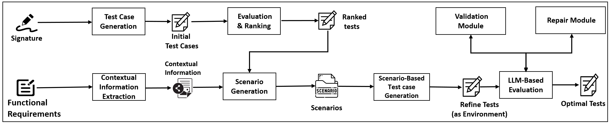

# Replication package for paper  
# "Scenario-Driven Test Case Generation with Autonomous Agents"



# TestCopilot  
Scenario-enriched LLM-based framework for automatic test case generation, bug detection, and test cases evaluation.

Scenario-Driven Test Case Generation with Autonomous Agents

---

# 🚀 Overview

TestCopilot is a multi-agent framework designed to automate software test case generation using Large Language Models (LLMs). It integrates scenario-enriched prompting, bug detection, and coverage analysis to produce high-quality and maintainable test suites.

The system is benchmarked on HumanEval, MBPP, and LeetCode, demonstrating strong performance across correctness, coverage, and maintainability metrics.

---

# 📊 Performance Highlights

```plaintext
TestCopilot significantly outperforms baseline models:

Metric                                  TestCopilot
------------------------------------------------------------
TCE (HumanEval)                         99.3%
Coverage (HumanEval)                    99.5%
Bugs Detected (HumanEval)               179
False Alarms (HumanEval)                0
Maintainability Index (HumanEval)       71.30%

TCE (MBPP)                              99.3%
Coverage (MBPP)                         99.5%
Bugs Detected (MBPP)                    157
False Alarms (MBPP)                     0
Maintainability Index (MBPP)            83.31%

TCE (LeetCode)                          64.8%
Coverage (LeetCode)                     92.7%
Bugs Detected (LeetCode)                178
False Alarms (LeetCode)                 43
Maintainability Index (LeetCode)        47.5%
🔑 Key Features
✅ Scenario-Enriched Prompting
Integrates functional requirements and structured behavioral scenarios to guide LLMs in generating purpose-driven and semantically aligned test cases.

🧠 Multi-Agent Evaluation
Includes separate agents for:

Test generation

Structural validation (Informant)

Test refinement and repair (Fixer)

Robustness and effectiveness evaluation

📈 Deep Coverage Analysis
Calculates:

Test Case Effectiveness (TCE)

Function Coverage

Statement Coverage

Branch Coverage

Path Coverage

Maintainability Index (radon)

🔄 Test Repair Feedback Loop
Fixes incomplete or inconsistent test cases using bounded iterative repair (maximum 3 retries), without exposing reference implementations.

TestCopilot/
│
├── 📂 dataset/                         # HumanEval / MBPP benchmark datasets
│   ├── HumanEval_Scenario_testcases.xlsx
│   ├── MBPP_Scenario_testcases.xlsx
│
├── 📂 LLM-Based Evaluation/            # Multi-agent evaluation & robustness
│   ├── compute_repair_vs_discard.py
│   ├── compute_temp_token.py
│   ├── mainchatgpt.py
│   ├── maindeepseek.py
│   ├── reasoningandnonreasoning.py
│   ├── semantic_fidelity.py
│   ├── stats_robustness.py
│
├── 📂 baseline/                        # Baseline evaluations & metrics
│   ├── main.py
│   ├── mainaibugy.py
│   ├── mainbugsapproach.py
│   ├── maincompute_pyuguinmetrics.py
│   ├── maincoveragezero.py
│   ├── mainmaintainabilty.py
│   ├── mainpyuguin.py
│   ├── mainpyuguin_mutation.py
│   ├── mainstatandfunccov.py
│
├── 📂 scenariogenerated/               # Scenario generation pipeline
│   ├── main.py
│
├── .env                                # API keys (OpenAI, DeepSeek)
├── requirements.txt                    # Dependencies
└── README.md                           # Documentation
├── 📂 Real_project_validation/
|   ├──Docs
│   ├── REAL_PROJECT_METHODOLOGY.md
│   └── README_REAL_PROJECT_VALIDATION.md
│   ├── django_11133/
│   │   ├── generated_test.py
│   │   ├── buggy_validation_summary.json
│   │   ├── fixed_validation_summary.json
│   │   └── README.md
│   └── scripts/
│       ├── generate_swebench_scenarios_agents.py
│       ├── fix_validate_swebench_django_tests.py
│       └── validate_swebench_fixed_version.py
└── .env.example

📌 Requirements
🖥️ System
Python 3.9+


🔑 API Configuration

Set your API key before running evaluation.

Linux / macOS
export OPENAI_API_KEY=your_key_here

Windows
setx OPENAI_API_KEY "your_key_here"

▶️ Running TestCopilot

To run TestCopilot on your dataset:

Step #1 – Scenario Generation

python scenariogenerated/main.py \
  --input dataset/HumanEval_Scenario_testcases.xlsx \
  --output outputs/scenarios


Step #2 – Multi-Agent Evaluation (GPT-4 backend)

python "LLM-Based Evaluation/mainchatgpt.py" \
  --input outputs/scenarios \
  --output outputs/evaluated_tests

